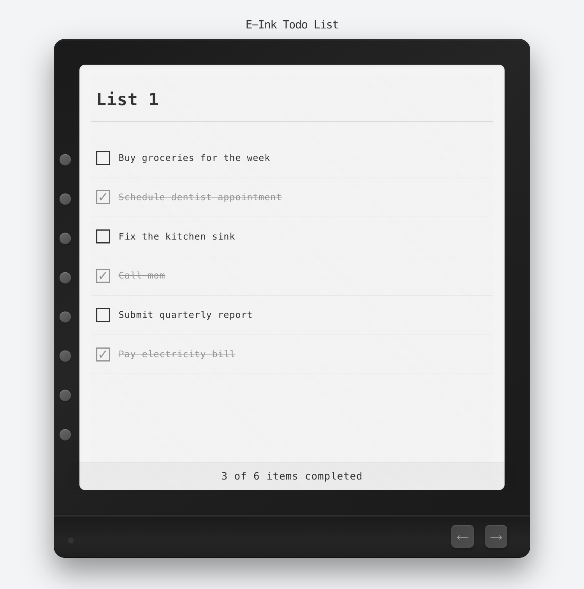

# TodoInk - E-Ink Style Voice Todo List

A minimalist todo list application with an e-ink aesthetic and voice input powered by local AI transcription. Built as a prototype for an e-ink device interface.



## Features

### Voice Input
- **Long-press to record** - Hold any side button and speak to add/edit items
- **Local AI transcription** - Uses Whisper Tiny model running entirely in your browser
- **Fast & private** - No API calls, audio never leaves your device
- **Visual feedback** - Recording light indicator and success animations

### Interface
- **E-ink inspired design** - Clean, monochrome interface optimized for e-ink displays
- **Multiple lists** - Navigate between different todo lists with arrow buttons
- **Physical buttons simulation** - 13 side buttons for quick task interactions
- **Progress tracking** - Summary bar showing completed items

### Interactions
- **Single click** - Toggle item completion
- **Double click** - Delete item
- **Long press** - Record voice to add/edit item
- **Arrow buttons** - Switch between lists

## Tech Stack

- **Frontend**: [Next.js 15](https://nextjs.org) with React 19
- **Styling**: [Tailwind CSS 4](https://tailwindcss.com)
- **AI Transcription**: [Transformers.js](https://huggingface.co/docs/transformers.js) with Whisper Tiny
- **Audio Processing**: Web Audio API
- **State Management**: React Hooks + localStorage
- **Build Tool**: Turbopack

## How It Works

1. **Model Preloading** - Whisper AI model loads automatically on page load with progress indicator
2. **Microphone Permission** - Browser requests mic access upfront for seamless recording
3. **Voice Recording** - Long-press triggers MediaRecorder API to capture audio
4. **Audio Processing** - AudioContext converts audio to proper format (16kHz Float32Array)
5. **Web Worker Transcription** - Offloads AI inference to background thread
6. **Instant Feedback** - Transcribed text appears immediately with visual confirmation

## Getting Started

### Installation

```bash
npm install
```

### Development

```bash
npm run dev
```

Open [http://localhost:3000](http://localhost:3000) with your browser.

**Note**: On first load, the Whisper model (~40MB) will download. Subsequent loads are instant thanks to browser caching.

### Build

```bash
npm run build
npm start
```

## Usage

1. **Grant Permissions** - Allow microphone access when prompted
2. **Wait for Model** - Yellow indicator shows model loading progress
3. **Start Recording** - When green "Ready to record!" appears, long-press any button
4. **Speak** - Say your todo item while holding the button
5. **Release** - Let go to transcribe and add the item
6. **Manage Tasks** - Click to complete, double-click to delete

## Key Features

### Privacy First
- ✅ 100% local processing
- ✅ No API keys required
- ✅ No data sent to servers
- ✅ Works offline after initial model download

### Performance
- ✅ Fast transcription (~2-3 seconds)
- ✅ Non-blocking UI with Web Workers
- ✅ Optimized model size (Whisper Tiny)
- ✅ Efficient audio processing

### User Experience
- ✅ Real-time loading progress
- ✅ Clear visual feedback
- ✅ Persistent data (localStorage)
- ✅ Responsive design

## Inspiration & References

E-ink todo list projects:
- [blog.praccu.com](https://blog.praccu.com/)
- [E-ink Todo Board](https://www.reddit.com/r/RASPBERRY_PI_PROJECTS/comments/1artkxj/eink_todo_board/)
- [Invisible Calendar](https://shop.invisible-computers.com/products/invisible-calendar)
- [Building an E-ink Planner](https://ben-foster.dev/2022/06/building-an-e-ink-planner/)

## License

MIT
